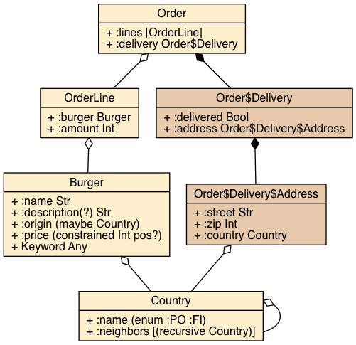

# Schema-viz

[Schema](https://github.com/plumatic/schema) visualization using Graphviz.

[](http://clojars.org/metosin(schema-viz))

## Prerequisites

Install [Graphviz](http://www.graphviz.org/).

## Usage

```clj
(require '[schema-viz.core :as svc])
(require '[schema.core :as s])

(s/defschema Country
  {:name (s/enum :fi :po)})

(s/defschema Burger
  {:name s/Str
   (s/optional-key :description) s/Str
   :origin Country
   :prize (s/constrained Long pos?)
   s/Keyword s/Any})

(s/defschema OrderLine
  {:burger Burger
   :amount (s/constrained s/Int pos?)})

(s/defschema Order
  {:lines [OrderLine]
   :delivery {:status s/Bool
              :address {:street s/Str
                        :zip s/Int
                        :country Country}
              :recipient {:name s/Str
                          :phone (s/maybe s/Int)}}})

(svc/visualize-schemas)
```

Produces the following visualization:



## License

Copyright © 2015-2016 [Metosin Oy](http://www.metosin.fi)

Distributed under the Eclipse Public License, the same as Clojure.
